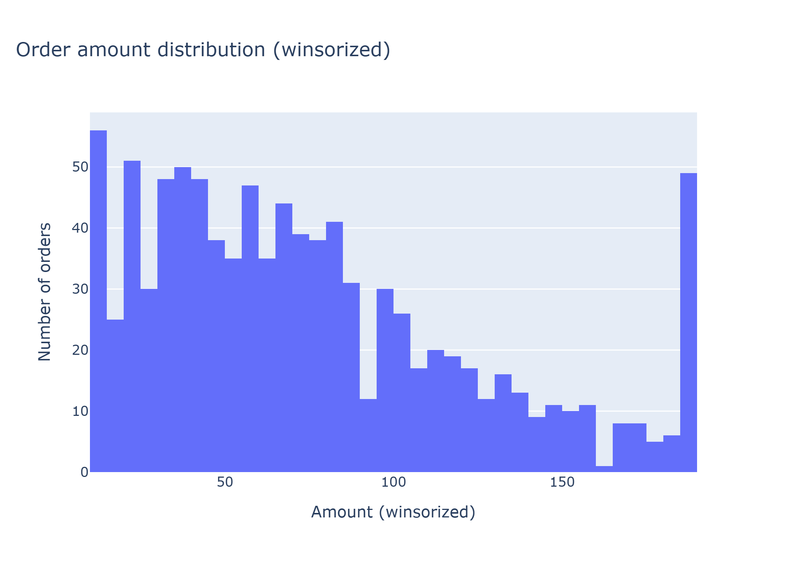
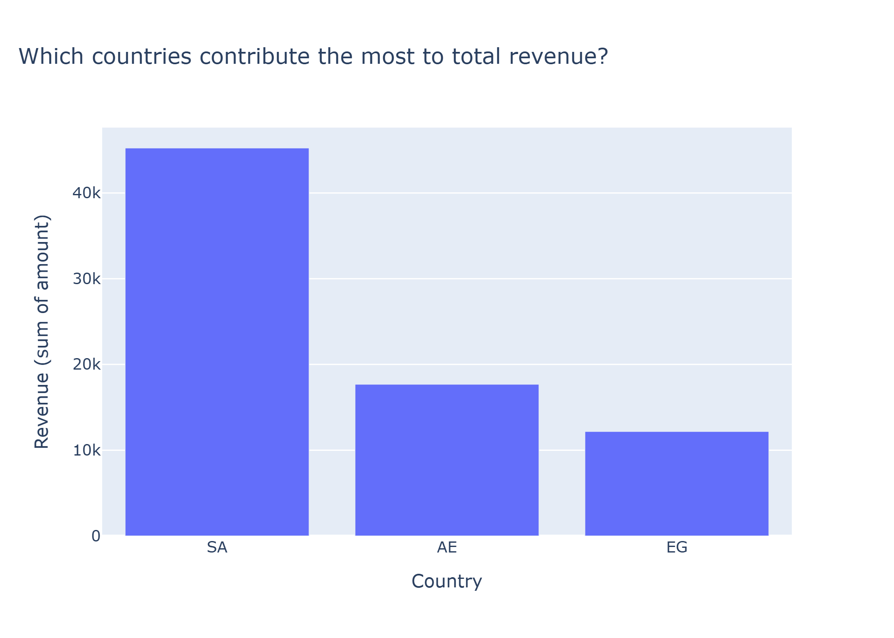
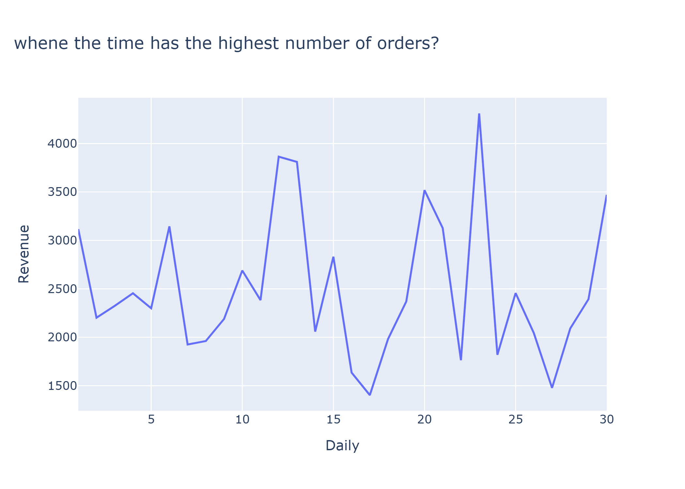

# Data Work — ETL + EDA Project

This project demonstrates an end-to-end data workflow, starting from raw data ingestion and ending with analytical outputs and exploratory data analysis (EDA).

The pipeline includes:
- loading raw datasets
- cleaning and transforming data
- building analytics tables
- exploring results using a Jupyter notebook

---

## Project Structure

```text
Data-work/
├─ data/
│  ├─ raw/                # Raw input data
│  └─ processed/          # Cleaned and transformed outputs
├─ scripts/
│  ├─ run_day1_load.py    # Load raw data
│  ├─ run_day2_clean.py   # Clean & transform
│  ├─ run_day3_build.py   # Build analytics tables
│  └─ run_etl.py          # Full pipeline runner
├─ src/
│  └─ bootcamp_data/      # Core ETL logic (src layout)
├─ notebooks/
│  └─ eda.ipynb           # Exploratory Data Analysis
├─ reports/
│  └─ figures/            # Exported charts
├─ requirements.txt
└─ README.md
```

## Setup

Create a virtual environment and install dependencies using `uv`:

```bash
cd Data-work
uv venv -p 3.11

Activate the environment:

Mac / Linux
source .venv/bin/activate


Windows (PowerShell)
.venv\Scripts\activate

Install required packages:
uv pip install -r requirements.txt
```


## Run ETL

### Full Pipeline (Recommended)

Run the entire ETL pipeline using a single command:

```bash
uv run python scripts/run_etl.py
```

This command executes all ETL stages in order:
- loads raw input data
- cleans and transforms datasets
- builds analytics tables
- writes all processed outputs to disk

Use this option to reproduce the full workflow from start to finish.

---

### Step-by-Step Execution (Optional)

Each ETL stage can be executed independently for debugging or development:

```bash
uv run python scripts/run_day1_load.py
uv run python scripts/run_day2_clean.py
uv run python scripts/run_day3_build.py
```

Run the scripts in the listed order to ensure dependencies between stages are respected.

## Outputs

After running the ETL pipeline, the following files will be generated:

```text
data/processed/orders_clean.parquet
data/processed/users.parquet
data/processed/analytics_table.parquet
data/processed/_run_meta.json
reports/figures/*.png
```

---

## Exploratory Data Analysis (EDA)

Open the EDA notebook and run all cells to reproduce the analysis and charts:

```text
notebooks/eda.ipynb
```

All generated figures should be saved under:

```text
reports/figures/
```

### Figures Placeholder

Use the section below to add or reference exported figures:

```markdown
https://github.com/Osamhkk-Ai/Data-work/blob/main/reports/figures/OrderDistribution.png





```

---

## Project Notes

- The ETL pipeline is separated into load, clean, and build stages.
- Scripts are designed to be safe to re-run.
- Processed data is stored in Parquet format for performance and consistency.
